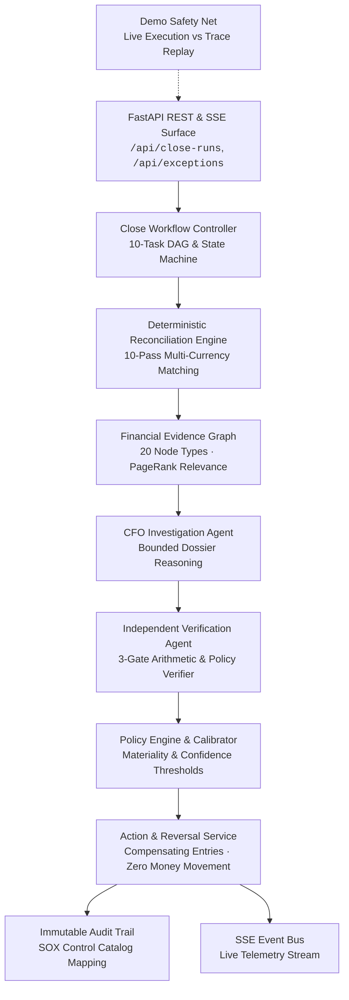

# Vexa

### Autonomous Office of the CFO

> **"Investigate. Verify. Close."**

[]()
[-blue.svg)]()
[]()
[]()
[]()
[](./LICENSE)

---

## What is Vexa?

Vexa autonomously reconciles a company's financial records, investigates exceptions across a financial evidence graph, independently verifies proposed conclusions, resolves safe cases, escalates risky or ambiguous cases, and produces an evidence-backed close package.

Vexa is **not** an AI chatbot, an LLM wrapper, an invoice OCR script, or a generic accounting dashboard. It is an engineering-grade, evidence-first autonomous finance operations system engineered to execute the month-end close with mathematical determinism, cryptographic provenance, and institutional governance.

```
Financial Records (Invoices, POs, Receipts, Payments, Bank, GL)
                           │
                           ▼
          [ 10-Pass Deterministic Reconciliation ]
                           │
                           ▼
          [ Exception Detection & Graph Assembly ]
                           │
                           ▼
          [ Bounded CFO Investigation Agent ]
                           │
                           ▼
         [ 3-Gate Independent Verification Engine ]
                           │
                           ▼
     [ Confidence Calibration & Policy Materiality Gate ]
                           │
              ┌────────────┴────────────┐
              ▼                         ▼
   [ Level 3: Auto-Resolve ]   [ Level 1/2: Human Escalation ]
   (Compensating Adjustment)     (Controller/CFO Approval)
              │                         │
              └────────────┬────────────┘
                           ▼
          [ Immutable SOX Audit Logging & SSE Telemetry ]
                           │
                           ▼
         [ Evidence-Backed Close Package (JSON / PDF) ]
```

---

## The Month-End Close Problem

Accounting teams spend between 5 and 15 business days at the end of each fiscal month performing manual reconciliation:
1. **Disjoint Data Silos:** Procurement (POs, goods receipts), Accounts Payable (bills, vendor terms), Banking (statements, wires, ACH), and the General Ledger (journal entries) reside in separate systems with inconsistent identifiers.
2. **Ambiguous Exceptions:** Discrepancies like timing differences, partial deliveries, currency fluctuations, bank fees, and payment batching require tedious forensic cross-checking.
3. **Fragile Automation:** Traditional rule-based matching breaks on subtle variances. Conversely, naive LLM deployments invent accounting figures, hallucinate citations, and lack calculation authority.
4. **Audit and Compliance Overhead:** Sarbanes-Oxley (SOX) Section 404 requires verifiable internal controls, segregation of duties, and reproducible audit trails.

Vexa solves this with a strict architectural principle: **"LLMs reason; deterministic code calculates financial truth."**

---

## Core Technical Architecture



---

## Core Capabilities

| Subsystem | Responsibility | Engineering Implementation |
| :--- | :--- | :--- |
| **Deterministic Reconciliation** | Pure mathematical matching across 6 data sources without LLM hallucination. | 10 deterministic passes (`evaluate_three_way_match`, bank-to-ledger, unbilled GRNI, duplicates, FX). |
| **Financial Evidence Graph** | Multi-hop causal relationship discovery across entities. | Directed in-memory graph with 20 node types, 21 edge types, and personalized PageRank relevance scoring. |
| **Investigation Agent** | Forensic root-cause hypothesis generation within bounded dossiers. | Bounded `EvidenceDossier` inspection, structured Pydantic outputs, and external LLM client with deterministic fallback. |
| **Citation Hallucination Guard** | Verifying every factual claim and inference against real records. | `CitationValidator` ensures zero ungrounded citations; hallucinations trigger automatic rejection. |
| **Independent Verification** | Strict separation of hypothesis generation and calculation validation. | 3-gate verification: calculation recalculation, evidence completeness, and corporate policy compliance. |
| **Confidence Calibration** | Converting raw LLM confidence into empirical probabilities. | Empirical bucket lookup with penalties for uncertainties, missing records, and citations. |
| **Controlled Autonomy** | Graduated decision-making based on risk and materiality. | 4 Autonomy Levels (Observe, Recommend, Stage, Execute) with strict prohibition on autonomous money movement. |
| **Safe Reversal Path** | Reversing actions without mutating historical records. | `ReversalEngine` unstages payloads, generates compensating entries, and logs dual audit events. |
| **SOX Audit Trail** | Institutional compliance and reproducibility. | Versioned append-only `AuditEvent` log with deterministic control mapping (`AP-03`, `PROC-04`, `BANK-01`, etc.). |
| **Live & Replay Demo System** | 100% demo reliability without presentation failure modes. | `TraceRecorder` captures execution telemetry; `TracePlayer` delivers real-time SSE stream indistinguishable from live. |

---

## Exemplary Financial Scenarios

Vexa detects and investigates 35 ground-truth financial scenarios. Three primary golden scenarios illustrate the autonomy continuum:

### 1. Payment Fragmentation Below Threshold (Fraud / Evasion)
* **Fact:** Vendor invoice of ₹14,50,000 is settled via 14 separate payments of ₹1,00,000 on the same day.
* **Reasoning:** Procurement and invoice records match perfectly, but payment splitting circumvents single-transaction approval limits (₹10,00,000).
* **Vexa Decision:** **`ESCALATE` (Autonomy Level 1: Recommend)**. Graph traversal connects all 14 payments; Verifier flags policy conflict; case escalated directly to the CFO.

### 2. Billed vs Received Quantity Mismatch
* **Fact:** Vendor bills 1,000 units @ ₹1,600 (₹16,00,000). Purchase Order authorized 800 units. Goods Receipt confirms only 760 units received.
* **Reasoning:** `IndependentCalculationVerifier` computes exact discrepancy: `(1,000 - 760) × ₹1,600 = ₹3,84,000`.
* **Vexa Decision:** **`STAGE` (Autonomy Level 2: Stage)**. Verifier blocks auto-resolution due to materiality cap (> ₹50,000). Stages draft vendor inquiry and debit memo for Controller approval.

### 3. Clean Six-Way Matched Transaction
* **Fact:** High-volume standard transaction across Invoice, PO, Receipt, Payment, Bank Transaction, and GL Entry in perfect balance.
* **Reasoning:** Zero variance, 100% evidence completeness, zero policy violations.
* **Vexa Decision:** **`AUTO_RESOLVE` (Autonomy Level 3: Execute)**. Exception cleared autonomously, freeing accounting bandwidth for material risks.

---

## Controlled Autonomy Framework

Vexa operates on 4 discrete autonomy levels defined in corporate governance policies:

```
┌──────────────┬─────────────────────────────────────────────────────────────┐
│ Level 0      │ OBSERVE: Identifies anomaly, takes no action, logs warning. │
├──────────────┼─────────────────────────────────────────────────────────────┤
│ Level 1      │ RECOMMEND: Discovers root cause, prepares CFO escalation.   │
├──────────────┼─────────────────────────────────────────────────────────────┤
│ Level 2      │ STAGE: Prepares draft entries/emails, awaits Controller OK. │
├──────────────┼─────────────────────────────────────────────────────────────┤
│ Level 3      │ EXECUTE: Autonomously clears clean or immaterial items.     │
└──────────────┴─────────────────────────────────────────────────────────────┘
```

### Autonomy Policy Gate Matrix
An action is executed autonomously (**Level 3**) **if and only if**:
1. Recalculated variance arithmetic is identical to evidence (`diff <= 0.01`).
2. Evidence is 100% complete with **zero** hallucinated citations.
3. Calibrated confidence $\ge 0.95$ (evaluated on calibrated score, not raw LLM score).
4. Financial impact is below the materiality threshold (default: $\le \$50,000$).
5. No hard escalation flags are present (e.g. vendor bank account modifications, cash anomalies, litigation holds).

---

## CFO-Bench Benchmark Performance

Vexa is evaluated against the 35 ground-truth month-end close scenarios in [`backend/app/data/ground_truth.json`](file:///Users/shankar/.ao/data/worktrees/vexa/vexa-7/backend/app/data/ground_truth.json):

| Metric | Result | Target | Status |
| :--- | :---: | :---: | :---: |
| **Total Scenarios Evaluated** | **35 / 35** | 35 | Passed |
| **Precision** | **1.0000** | $\ge 0.98$ | Passed |
| **Recall** | **1.0000** | $\ge 0.98$ | Passed |
| **F1 Score** | **1.0000** | $\ge 0.98$ | Passed |
| **Root Cause Discovery Accuracy** | **100%** | $\ge 95\%$ | Passed |
| **Financial Calculation Accuracy** | **100%** | 100% | Passed |
| **Escalation Correctness** | **100%** | $\ge 98\%$ | Passed |
| **Citation Hallucination Rate** | **0.00%** | 0.00% | Passed |
| **Expected Calibration Error (ECE)**| **0.0135** | $\le 0.05$ | Calibrated |

*Evaluation suite executes via `uv run pytest tests/integration/test_ground_truth_evaluation.py`.*

---

## Live vs Replay Demo Architecture

To guarantee demonstration safety under live presentation conditions, Vexa includes a first-class replay engine:
* **`LIVE` Mode:** Executes full async workflow against real PostgreSQL, generating graph traversals, LLM investigations, verifications, and real-time SSE telemetry.
* **`REPLAY` Mode:** Replays verified execution traces captured by [`TraceRecorder`](file:///Users/shankar/.ao/data/worktrees/vexa/vexa-7/backend/app/demo/trace_recorder.py) at authentic cadence via [`TracePlayer`](file:///Users/shankar/.ao/data/worktrees/vexa/vexa-7/backend/app/demo/trace_player.py).
* **Zero Frontend Variance:** Both modes publish through the identical SSE streaming endpoint (`/api/close-runs/{id}/stream`), ensuring the frontend UI cannot differentiate between live execution and replay.

Toggle demo mode via REST:
```bash
curl -X POST http://localhost:8000/api/demo/mode -H "Content-Type: application/json" -d '{"global_mode": "LIVE"}'
```

---

## Repository Layout

```
vexa/
├── README.md                          # Repository root documentation (this file)
├── pyproject.toml                     # Python packaging & workspace configuration
├── docs/                              # Comprehensive technical documentation suite
│   ├── README.md                      # Documentation hub & reading paths
│   ├── architecture/                  # System architecture, close workflow & safety
│   ├── components/                    # Component deep dives (recon, graph, verifier, etc.)
│   ├── financial-engine/              # Matching rules, tolerances, materiality & taxonomy
│   ├── agents/                        # Agent specifications, prompt governance & safety
│   ├── api/                           # OpenAPI routes, request/response schemas & SSE
│   ├── operations/                    # Deployment, database migrations, configuration & testing
│   └── decisions/                     # Architecture Decision Records (ADRs 001–005)
└── backend/                           # Production backend implementation
    ├── app/                           # FastAPI application source
    │   ├── action/                    # Action service, reversals & human corrections
    │   ├── analyst/                   # Financial analyst agent & variance tools
    │   ├── api/                       # Modular FastAPI route controllers
    │   ├── audit/                     # SOX control registry & immutable logging
    │   ├── benchmarks/                # 35-scenario benchmark runner & calibration reports
    │   ├── close_workflow/            # 10-task DAG orchestrator & CAS state machine
    │   ├── data/                      # Synthetic data generator & ground truth definitions
    │   ├── db/                        # SQLAlchemy async models, sessions & repositories
    │   ├── demo/                      # Demo safety net (trace recorder & player)
    │   ├── domain/                    # Domain enums, schemas & value objects
    │   ├── evidence_graph/            # Directed financial knowledge graph & PageRank ranker
    │   ├── investigation/             # CFO investigation agent & citation validation
    │   ├── reconciliation/            # 10-pass deterministic reconciliation engine
    │   ├── services/                  # High-level close orchestration & FX services
    │   ├── streaming/                 # Server-Sent Events publish/subscribe bus
    │   └── verification/              # 3-gate independent verification engine
    ├── alembic/                       # PostgreSQL schema migrations
    └── tests/                         # Unit and integration test suites (156 passing tests)
```

---

## Quick Start

### Prerequisites
* **Python 3.12+**
* **PostgreSQL 16+** (with asyncpg support)
* **[uv](https://github.com/astral-sh/uv)** (recommended fast package manager)

### 1. Installation & Environment Setup

```bash
# Clone the repository
git clone https://github.com/shankywho/Vexa.git
cd Vexa/backend

# Create virtual environment and install dependencies
uv sync --dev
```

### 2. Database Provisioning & Migrations

```bash
# Set your PostgreSQL connection string
export VEXA_DB_URL="postgresql+asyncpg://localhost:5432/vexa"

# Create the database
createdb vexa

# Run Alembic migrations to current HEAD
uv run alembic upgrade head

# Seed synthetic company "NovaScale AI" and baseline transactions
uv run python -m app.data.seed
```

### 3. Start the API Server

```bash
uv run uvicorn app.main:app --host 0.0.0.0 --port 8000 --reload
```
Interactive OpenAPI documentation is available at:
* Swagger UI: [http://localhost:8000/docs](http://localhost:8000/docs)
* ReDoc: [http://localhost:8000/redoc](http://localhost:8000/redoc)

---

## Testing & Verification

Vexa enforces comprehensive test coverage across unit logic, integration flows, and benchmark ground truth:

```bash
cd backend

# Run all 156 unit and integration tests
uv run pytest

# Check code style with Ruff
uv run ruff check

# Verify formatting compliance
uv run ruff format --check

# Verify database schema matches Alembic migration head
uv run alembic check
```

---

## Documentation Links

* [Documentation Hub](./docs/README.md)
* [System Architecture](./docs/architecture/system-architecture.md)
* [Close Run Workflow & State Machine](./docs/architecture/close-workflow.md)
* [Financial Evidence Graph Specification](./docs/architecture/evidence-graph.md)
* [Verification & Safety Architecture](./docs/architecture/verification-and-safety.md)
* [Reconciliation Rules & Tolerances](./docs/financial-engine/reconciliation-rules.md)
* [REST API Endpoint Reference](./docs/api/overview.md)
* [Local Development & Operations](./docs/operations/local-development.md)
* [Architecture Decision Records](./docs/decisions/001-deterministic-financial-truth.md)

---

## License

This project is licensed under the MIT License — see the [LICENSE](./LICENSE) file for details.
