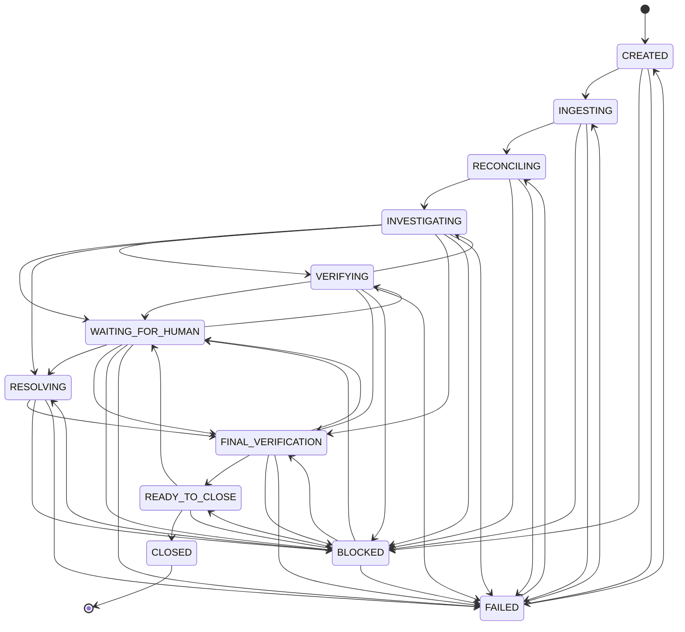
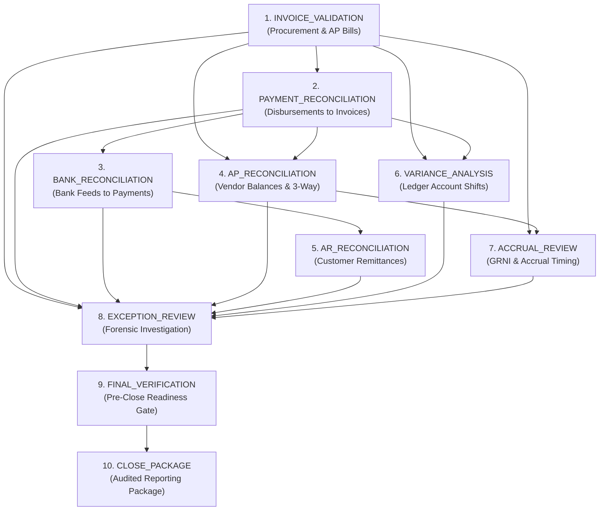
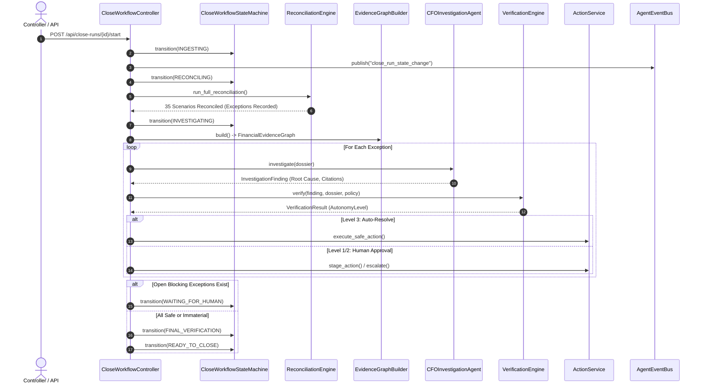

# Close Run Lifecycle & Orchestration Workflow

The Close Run workflow in Vexa manages the month-end financial closing process across a company's ledger, banking feeds, procurement documents, and subledgers.

---

## 1. Close Run State Machine

A `CloseRun` transitions through 12 formal states governed by [`CloseWorkflowStateMachine`](../../backend/app/close_workflow/state_machine.py).



### State Definitions
* **`CREATED`**: Initial state upon close run initialization.
* **`INGESTING`**: Reading and validating source feeds and financial batches.
* **`RECONCILING`**: Executing the 10-pass deterministic reconciliation engine.
* **`INVESTIGATING`**: CFO Investigation Agent examining detected exceptions within bounded evidence dossiers.
* **`VERIFYING`**: Independent Verification Agent running calculation, evidence completeness, and policy checks.
* **`WAITING_FOR_HUMAN`**: Paused pending review by Controller or CFO on staged or escalated exceptions.
* **`RESOLVING`**: Executing approved or autonomous compensating actions and adjustments.
* **`FINAL_VERIFICATION`**: Verifying all mandatory tasks and confirming zero unreviewed blocking exceptions.
* **`READY_TO_CLOSE`**: All checks passed; close package assembled; awaiting executive sign-off.
* **`CLOSED`**: Final terminal state. Month-end close completed and locked.
* **`BLOCKED`**: Progress halted due to unresolved material exceptions, policy violations, or feed gaps.
* **`FAILED`**: Unrecoverable runtime or system error encountered.

### Concurrency Control via Compare-And-Swap (CAS)
To eliminate duplicate transitions from simultaneous triggers, state updates require the current version:
```python
# app/close_workflow/state_machine.py
stmt = (
    update(CloseRun)
    .where(
        CloseRun.id == close_run_id,
        CloseRun.version == close_run.version,
        CloseRun.status == current_status,
    )
    .values(status=new_status, version=CloseRun.version + 1)
    .returning(CloseRun.version)
)
```
If another process modified the close run concurrently, the query returns `None` and raises `CloseRunError("Concurrent modification; close run state changed elsewhere")`.

---

## 2. Close Task Dependency DAG

Vexa defines 10 discrete close tasks. The [`TaskDependencyResolver`](../../backend/app/close_workflow/dependencies.py) constructs and verifies a Directed Acyclic Graph (DAG) enforcing deterministic topological ordering:



### Direct Prerequisites
| Task | Prerequisites |
| :--- | :--- |
| `INVOICE_VALIDATION` | *None (Root)* |
| `PAYMENT_RECONCILIATION` | `INVOICE_VALIDATION` |
| `BANK_RECONCILIATION` | `PAYMENT_RECONCILIATION` |
| `AP_RECONCILIATION` | `INVOICE_VALIDATION`, `PAYMENT_RECONCILIATION` |
| `AR_RECONCILIATION` | `BANK_RECONCILIATION` |
| `VARIANCE_ANALYSIS` | `INVOICE_VALIDATION`, `PAYMENT_RECONCILIATION` |
| `ACCRUAL_REVIEW` | `INVOICE_VALIDATION`, `AP_RECONCILIATION` |
| `EXCEPTION_REVIEW` | All 7 prior tasks (`INVOICE_VALIDATION` through `ACCRUAL_REVIEW`) |
| `FINAL_VERIFICATION` | `EXCEPTION_REVIEW` |
| `CLOSE_PACKAGE` | `FINAL_VERIFICATION` |

---

## 3. Workflow Execution Sequence

The [`CloseWorkflowController`](../../backend/app/close_workflow/controller.py) executes the close workflow through structured phases:



---

## 4. Close Readiness Evaluation

Before advancing to `READY_TO_CLOSE`, [`CloseReadinessEvaluator`](../../backend/app/close_workflow/readiness.py) inspects company ledger state:
1. **Mandatory Task Completion:** Every close task must be in `COMPLETED` status.
2. **Zero Blocking Exceptions:** Exceptions of severity `CRITICAL` or `HIGH` must not remain in `OPEN` or `INVESTIGATING` status.
3. **Materiality Gate:** Total unresolved financial variance must not exceed the policy materiality threshold (default: $50,000).
4. **Data Integrity:** Zero open `DATA_INGESTION_GAP` or `GL_MAPPING_ERROR` exceptions.

If any criterion fails, the close run transitions to `BLOCKED` and publishes the root cause to the SSE stream.

---

## 5. Close Package Generation

Once marked `READY_TO_CLOSE` or `CLOSED`, the system compiles an immutable **Close Package** ([`ClosePackageRead`](../../backend/app/domain/schemas.py)):
* **Close Metadata:** Period dates, company ID, duration, close version.
* **Reconciliation Summary:** Total records processed, match counts, partials, mismatches, and missing documents.
* **Exceptions Log:** Resolved, staged, and escalated exceptions with causal explanations and verified impact.
* **Audit Footprint:** Complete history of append-only audit events, prompt version references, and SOX control IDs.
* **Verification & Reversal Logs:** Verification pass rates, calculation audits, and any action reversal history.
* **Calibration Metrics:** Average calibrated confidence and Expected Calibration Error (ECE).
