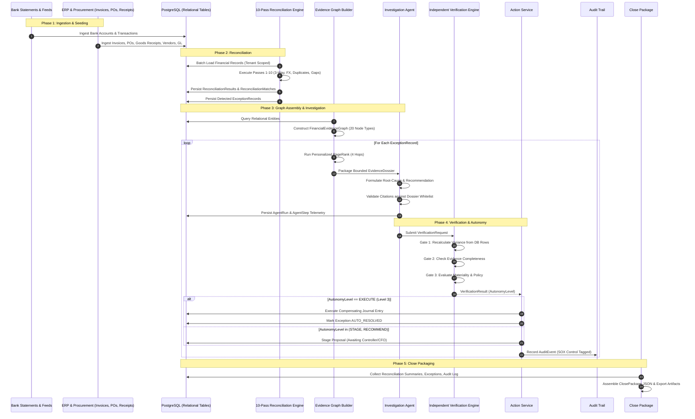

# End-to-End Financial Data Flow

This document details the complete data lifecycle as transactions flow from primary ingestion sources through reconciliation, investigation, independent verification, and close package assembly.

---

## 1. Complete Financial Data Lifecycle

---

## 2. Transformation Pipeline Stages

### Stage 1: Ingestion & Relational Persistence
* **Source Systems:** Treasury bank feeds, Accounts Payable invoices, procurement Purchase Orders, warehouse Goods Receipts, and General Ledger journal batches.
* **Storage Contract:** Relational tables in PostgreSQL (`invoices`, `purchase_orders`, `bank_transactions`, `journal_entries`, etc.) with strict foreign keys and non-nullable `company_id`.
* **Integrity Guard:** Floating-point numbers are forbidden; monetary values are stored in `Numeric(18, 4)` and operated on via Python `Decimal`.

### Stage 2: Reconciliation & Exception Generation
* **Processing:** Deterministic batch evaluation across 10 passes.
* **Output:**
  - Matched items generate `ReconciliationMatch` records.
  - Discrepancies generate `ExceptionRecord` entries with initial `financial_impact`, `severity`, and `exception_type`.

### Stage 3: Graph Construction & Dossier Bounding
* **Processing:** The `FinancialEvidenceGraphBuilder` queries tenant rows and instantiates an in-memory graph.
* **Extraction:** For each exception, a bounded `EvidenceDossier` is built containing:
  - Whitelist of `valid_record_ids`
  - Primary offending record
  - Up to 4-hop related records and edges
  - Top 10 ranked evidence nodes

### Stage 4: Agent Reasoning & Citation Verification
* **Processing:** The CFO Investigation Agent receives the dossier and outputs:
  - Structured facts (each citing an explicit record ID)
  - Inferences (each citing supporting evidence)
  - Root cause explanation
  - Recommended action
* **Guard:** `CitationValidator` scans all cited IDs against the dossier whitelist. Any unrecognized ID is flagged as a hallucination, triggering severe confidence penalties.

### Stage 5: Verification, Action & Reversal
* **Processing:** `VerificationEngine` independently computes the variance arithmetic.
* **Gatekeeper:** `PolicyGateVerifier` determines whether the item qualifies for `AUTO_RESOLVE` ($\le \$50k$, calibrated confidence $\ge 0.95$) or requires human staging/escalation.
* **Audit:** Every action logs an append-only `AuditEvent` with actor, prompt version, policy version, and SOX control ID (`AP-03`, `PROC-04`, etc.).

### Stage 6: Close Package Assembly
* **Output:** A sealed, immutable close package containing close run metrics, task states, exception tallies, audit footprints, and calibration reports.
