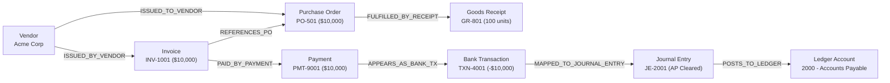
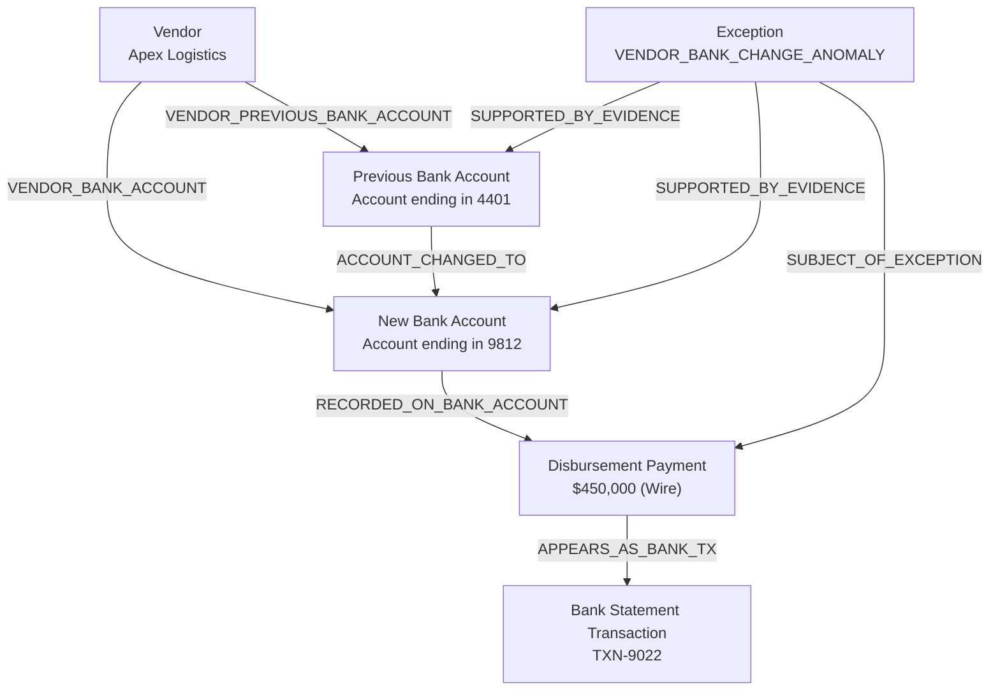

# Financial Evidence Graph Specification

Vexa models financial relationships as a directed knowledge graph rather than unstructured text embeddings. This ensures exact entity provenance, multi-hop causal tracing, and mathematically verifiable context retrieval.

---

## 1. Graph Ontology: Node Types (20)

Every business entity is represented as an [`EvidenceNode`](../../backend/app/evidence_graph/types.py) with unique ID format `{node_type}:{record_id}`:

| Node Type | Domain Object | Typical Attributes |
| :--- | :--- | :--- |
| `COMPANY` | Tenant Organization | `name`, `base_currency`, `tax_id` |
| `VENDOR` | Supplier / Creditor | `name`, `tax_id`, `bank_account_id`, `previous_bank_account_id` |
| `CUSTOMER` | Debtor / Client | `name`, `credit_limit`, `currency` |
| `INVOICE` | AP / AR Bill | `invoice_number`, `total`, `tax`, `currency`, `due_date` |
| `INVOICE_LINE` | Line Item | `description`, `quantity`, `unit_price`, `amount`, `po_line_id` |
| `PURCHASE_ORDER` | Procurement Authorization | `po_number`, `order_date`, `total`, `currency` |
| `PO_LINE` | PO Item | `description`, `quantity`, `unit_price`, `amount` |
| `GOODS_RECEIPT` | Warehouse Delivery Log | `receipt_number`, `receipt_date`, `status` |
| `RECEIPT_LINE` | Received Item | `quantity_received`, `po_line_id` |
| `PAYMENT` | Cash Disbursement / Inflow | `amount`, `payment_date`, `beneficiary_reference`, `currency` |
| `BANK_ACCOUNT` | Treasury Account | `account_name`, `account_number`, `currency` |
| `BANK_TRANSACTION`| Bank Statement Line | `amount`, `direction`, `reference`, `counterparty` |
| `LEDGER_ACCOUNT` | Chart of Accounts | `account_number`, `account_name`, `account_type` |
| `JOURNAL_ENTRY` | General Ledger Transaction | `entry_date`, `description`, `reference` |
| `JOURNAL_ENTRY_LINE`| GL Line (Debit/Credit) | `debit`, `credit`, `description`, `account_id` |
| `EXPENSE_REPORT` | Employee Expense | `report_number`, `total_amount`, `employee_name` |
| `CONTRACT` | Vendor Agreement | `title`, `start_date`, `end_date`, `value` |
| `FX_RATE` | Currency Exchange Rate | `base_currency`, `quote_currency`, `rate`, `effective_date` |
| `RECONCILIATION_RESULT`| Match Evaluation | `status`, `reconciliation_type`, `variance` |
| `EXCEPTION` | Flagged Variance / Anomaly | `type`, `severity`, `financial_impact`, `status` |

---

## 2. Graph Ontology: Edge Types (21)

Relationships are modeled as directed [`EvidenceEdge`](../../backend/app/evidence_graph/types.py) instances:

```
[Source Node] ──(Edge Type)──> [Target Node]
```

### 2.1 Master Data & Vendor Governance
* `BELONGS_TO_COMPANY`: Entity ownership boundary.
* `CUSTOMER_OF_COMPANY`: Customer tenant membership.
* `CONTRACT_WITH_VENDOR`: Binding vendor contract.
* `VENDOR_BANK_ACCOUNT`: Active disbursement account on vendor master record.
* `VENDOR_PREVIOUS_BANK_ACCOUNT`: Historical bank account prior to modification.
* `ACCOUNT_CHANGED_TO`: Edge linking retired bank account to newly designated account.

### 2.2 Procurement & Invoicing Flow
* `ISSUED_BY_VENDOR`: Vendor issuing an Invoice.
* `ISSUED_TO_VENDOR`: Company issuing a Purchase Order to Vendor.
* `REFERENCES_PO`: Invoice pointing to authorizing Purchase Order.
* `CONTAINS_LINE`: Parent document (Invoice, PO, Receipt, GL) linking to Line Item.
* `FULFILLED_BY_RECEIPT`: Purchase Order fulfilled by Goods Receipt.
* `REFERENCES_PO_LINE`: Invoice Line matching against specific PO Line.
* `RECEIPT_FULFILLS_PO_LINE`: Goods Receipt Line matching against PO Line.

### 2.3 Payments & Settlement
* `PAID_BY_PAYMENT`: Invoice settled by Payment.
* `PAYMENT_PAYS_INVOICE`: Payment referencing billed Invoice.
* `PAYMENT_TO_VENDOR`: Payment remitted to Vendor.
* `PAYMENT_ON_ACCOUNT`: Unapplied cash on customer account.
* `EXPENSE_PAID_BY`: Expense report reimbursed via Payment.
* `APPEARS_AS_BANK_TX`: Payment clearing as Bank Statement Transaction.
* `RECORDED_ON_BANK_ACCOUNT`: Bank Transaction debited/credited to Bank Account.

### 2.4 General Ledger & Compliance
* `MAPPED_TO_JOURNAL_ENTRY`: Bank transaction or payment posted to General Ledger.
* `POSTS_TO_LEDGER`: Journal entry line posting to Chart of Accounts.
* `CONVERTED_WITH_FX`: Multi-currency conversion applying FX rate record.
* `EVALUATES_RECORD`: Reconciliation rule evaluating financial record.
* `SUBJECT_OF_EXCEPTION`: Discrepant record that generated an Exception.
* `SUPPORTED_BY_EVIDENCE`: Exception linked to supporting proof node.

---

## 3. Structural Graph Examples

### Example 1: Procurement-to-Payment Settlement Path



### Example 2: Vendor Bank Modification Anomaly (Fraud Defense)



---

## 4. Relevance Ranking & Subgraph Extraction

When an exception is identified, the full company graph (which may contain tens of thousands of nodes) must be distilled into a focused context for investigation.

The [`EvidenceRanker`](../../backend/app/evidence_graph/ranker.py) computes a personalized PageRank starting from the exception's focus node:
1. **Teleport Vector:** Initial probability mass $1.0$ is placed on the primary entity triggering the exception.
2. **Directed Power Iteration:** Mass propagates across outgoing and incoming edges over 4 iterations with damping factor $\alpha = 0.85$.
3. **Distance Decay:** Scores decay exponentially with graph distance:
   $$\text{Score}(u) = \text{PageRank}(u) \times e^{-0.5 \cdot \text{hop\_distance}}$$
4. **Pruning & Extraction:** Nodes exceeding relevance threshold (default: $0.05$) are extracted into an [`EvidenceSubgraph`](../../backend/app/evidence_graph/types.py) and packaged into the investigation dossier.

---

## 5. Multi-Tenant Graph Isolation Invariant

The evidence graph enforces multi-tenancy at the data structure level:
```python
# app/evidence_graph/graph.py
def add_node(self, node: EvidenceNode) -> None:
    if node.company_id != self.company_id:
        raise TenantIsolationViolationError(
            f"Cross-tenant node injection blocked: {node.company_id} != {self.company_id}"
        )
```
Any attempt to insert a node or edge across company boundaries raises an immediate `TenantIsolationViolationError`, preventing cross-company contamination.
