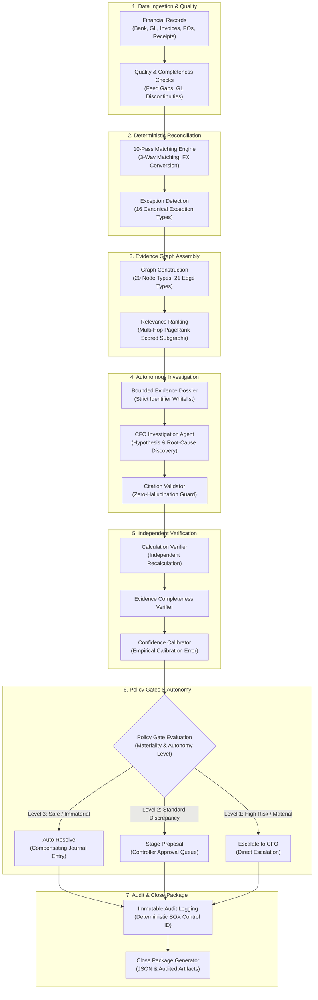

# Vexa Architecture Overview

Vexa is an evidence-first autonomous month-end-close operating system for corporate finance. It executes end-to-end reconciliation, anomaly detection, root-cause investigation, independent arithmetic and policy verification, and close package assembly.

---

## 1. Executive Summary & Philosophy

Corporate accounting demands exact arithmetic, deterministic state transitions, and institutional auditability. Traditional LLM application designs (such as unstructured chatbots or naive ReAct loops) fail in finance because:
1. LLMs make arithmetic rounding errors and hallucinate balances.
2. LLMs invent citations to records that do not exist.
3. LLMs cannot be granted direct authority to mutate financial ledgers or disburse funds.

Vexa addresses these failure modes by enforcing the fundamental architectural invariant:

> **"LLMs reason; deterministic code calculates financial truth."**

LLMs are utilized strictly for semantic interpretation, qualitative synthesis, and hypothesis formation within mathematically bounded dossiers. All financial balances, variances, matching evaluations, and policy gates are evaluated by deterministic Python engines and verified against PostgreSQL records.

---

## 2. End-to-End Financial Pipeline

The end-to-end month-end close workflow progresses through a directed pipeline:

---

## 3. Core Architectural Subsystems

### 3.1 Close Workflow Controller & State Machine
The close lifecycle is orchestrated by a topological Directed Acyclic Graph (DAG) of 10 interdependent close tasks (`INVOICE_VALIDATION` through `CLOSE_PACKAGE`). All state transitions are guarded by atomic Compare-And-Swap (CAS) version checks on PostgreSQL rows, preventing duplicate task executions or concurrency races.

### 3.2 10-Pass Deterministic Reconciliation Engine
Reconciliation executes as a batch pipeline across procurement, banking, and general ledger records. Passes cover three-way matching, goods-receipts-not-invoiced (GRNI) accrual candidates, duplicate invoice/payment detection, payment fragmentation patterns, foreign exchange conversion via historical rates, and general ledger balance validation.

### 3.3 Financial Evidence Graph
Instead of flattening financial data into text embeddings, Vexa maintains a typed directed graph connecting business entities across 20 node types (Invoices, Purchase Orders, Bank Transactions, Accounts) and 21 edge types (`REFERENCES_PO`, `PAID_BY_PAYMENT`, `POSTS_TO_LEDGER`). Subgraphs surrounding each detected exception are isolated, and a personalized PageRank ranker scores relevant context up to 4 hops away.

### 3.4 Bounded CFO Investigation Agent
The Investigation Agent receives a frozen, immutable `EvidenceDossier`. The agent is strictly forbidden from querying arbitrary tables or accessing unbounded context. Its outputs (facts, inferences, root cause, and recommendations) are validated by a `CitationValidator` that confirms every cited record ID exists in the dossier.

### 3.5 3-Gate Independent Verification Engine
To prevent agent self-confirmation bias, verification is handled by an isolated engine independent of the investigation process:
1. **Gate 1 (Calculation Verification):** Independently recalculates financial impacts directly from primary records without reading the agent's textual claims.
2. **Gate 2 (Completeness Verification):** Verifies that mandatory supporting documents (e.g. POs for invoices, bank transactions for payments) are present.
3. **Gate 3 (Policy Gate):** Applies materiality caps (default: $50,000 max auto-resolution), relative account balance limits, and calibrated confidence thresholds ($\ge 0.95$).

### 3.6 Controlled Autonomy & Reversals
Actions are strictly partitioned into 4 levels (`OBSERVE`, `RECOMMEND`, `STAGE`, `EXECUTE`). The system **strictly forbids autonomous money movement** (no ACH, wire, or card transfers). When an action is executed, it can be reversed at any point by human controllers via a dedicated `ReversalEngine` that crafts offsetting compensating entries and leaves an immutable audit footprint.

### 3.7 SOX Control Catalog & Audit Trail
Every significant state mutation, agent reasoning step, and human decision emits an immutable `AuditEvent` record. Events deterministically map to recognized internal control IDs (`AP-03`, `AP-07`, `PROC-04`, `GL-02`, `BANK-01`, `CLOSE-01`, `REV-01`, `EXP-01`) without LLM involvement.

### 3.8 Real-Time Streaming (SSE) & Demo Safety Net
A publish-subscribe event bus delivers live execution steps, task updates, and audit logs to the frontend via Server-Sent Events (SSE). To ensure 100% demo reliability under presentation conditions, the demo subsystem supports instantaneous toggling between `LIVE` execution and deterministic `REPLAY` of pre-recorded traces.

---

## 4. Multi-Tenant Isolation Invariant

Vexa enforces tenant boundaries at every software layer:
* **Database Models:** Every database table carries a foreign key `company_id`.
* **Repository Queries:** All repository queries require `company_id` and include explicit tenant filtering in SQL predicates (`WHERE company_id = :company_id`).
* **Evidence Graph:** Graph nodes and edges carry `company_id`; cross-tenant edges trigger immediate runtime exceptions.
* **API Endpoints:** Tenant context is resolved from route parameters or authenticated context, never trusted from unverified agent payloads.

---

## 5. Architectural Directory Map

* [`app/close_workflow/`](file:///Users/shankar/.ao/data/worktrees/vexa/vexa-8/backend/app/close_workflow) — Workflow DAG, state machine, task executors, and close readiness.
* [`app/reconciliation/`](file:///Users/shankar/.ao/data/worktrees/vexa/vexa-8/backend/app/reconciliation) — 10-pass deterministic matching engine, rules, and tolerances.
* [`app/evidence_graph/`](file:///Users/shankar/.ao/data/worktrees/vexa/vexa-8/backend/app/evidence_graph) — Directed financial knowledge graph and relevance ranker.
* [`app/investigation/`](file:///Users/shankar/.ao/data/worktrees/vexa/vexa-8/backend/app/investigation) — Investigation agent, citation validation, and confidence calibration.
* [`app/verification/`](file:///Users/shankar/.ao/data/worktrees/vexa/vexa-8/backend/app/verification) — 3-gate independent verification engine and policy evaluator.
* [`app/action/`](file:///Users/shankar/.ao/data/worktrees/vexa/vexa-8/backend/app/action) — Action execution, 1-click reversals, and human correction metrics.
* [`app/audit/`](file:///Users/shankar/.ao/data/worktrees/vexa/vexa-8/backend/app/audit) — Immutable audit logging and SOX control mapping.
* [`app/streaming/`](file:///Users/shankar/.ao/data/worktrees/vexa/vexa-8/backend/app/streaming) — Real-time Server-Sent Events bus.
* [`app/demo/`](file:///Users/shankar/.ao/data/worktrees/vexa/vexa-8/backend/app/demo) — Live/Replay mode controller and trace player.
