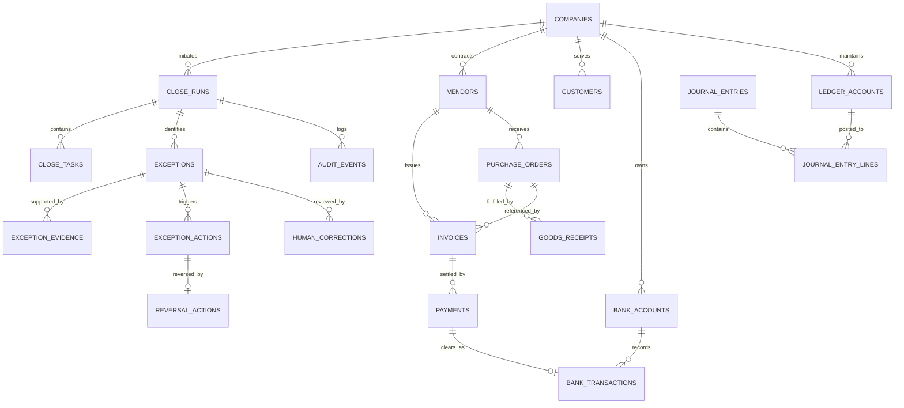

# Database & Storage Component Deep Dive

The Database component manages relational persistence in PostgreSQL. In Vexa, relational tables are the authoritative source of financial truth; conversational context or LLM memory is never treated as financial state.

---

## 1. Package Structure

Located at [`backend/app/db/`](file:///Users/shankar/.ao/data/worktrees/vexa/vexa-8/backend/app/db/):

```
app/db/
├── __init__.py
├── base.py           # Base declarative model, UUIDMixin, TimestampMixin
├── repository.py     # Tenant-isolated repository access layer
├── session.py        # AsyncSession factory & engine pool management
└── models/           # SQLAlchemy Declarative Models
    ├── __init__.py
    ├── agent.py            # AgentRun, AgentStep
    ├── audit.py            # AuditEvent
    ├── banking.py          # BankAccount, BankTransaction, Payment
    ├── close_run.py        # CloseRun, CloseTask, ClosePackage, CloseSignOff
    ├── counterparty.py     # Vendor, Customer
    ├── demo.py             # DemoTrace
    ├── exception.py        # ExceptionRecord, ExceptionEvidence, ExceptionAction, ReversalAction
    ├── fx.py               # FxRate
    ├── human_correction.py # HumanCorrection
    ├── ledger.py           # LedgerAccount, JournalEntry, JournalEntryLine
    ├── procurement.py      # PurchaseOrder, GoodsReceipt, Invoice, Lines
    └── tenancy.py          # Company, User, Role
```

---

## 2. Core Entity Relationship Diagram



---

## 3. Relational Table Summary

| Table | Domain Role | Key Columns |
| :--- | :--- | :--- |
| `companies` | Tenant Root | `id`, `name`, `base_currency`, `tax_id` |
| `close_runs` | Month-End Close Job | `id`, `company_id`, `period_start`, `period_end`, `status`, `version` |
| `close_tasks` | Close DAG Steps | `id`, `close_run_id`, `task_type`, `status`, `result_summary` |
| `vendors` | Supplier Master Data | `id`, `name`, `tax_id`, `bank_account_id`, `previous_bank_account_id` |
| `customers` | Client Master Data | `id`, `name`, `credit_limit`, `currency` |
| `purchase_orders` | Purchasing Order | `id`, `vendor_id`, `po_number`, `order_date`, `total`, `status` |
| `goods_receipts` | Delivery Receipts | `id`, `po_id`, `receipt_number`, `receipt_date` |
| `invoices` | AP / AR Bills | `id`, `vendor_id`, `po_id`, `invoice_number`, `total`, `tax`, `currency` |
| `payments` | Cash Disbursements | `id`, `vendor_id`, `invoice_id`, `bank_account_id`, `amount`, `currency` |
| `bank_accounts` | Corporate Accounts | `id`, `account_name`, `account_number`, `currency` |
| `bank_transactions`| Bank Statement Feed | `id`, `bank_account_id`, `amount`, `direction`, `reference` |
| `ledger_accounts` | Chart of Accounts | `id`, `account_number`, `account_name`, `account_type` |
| `journal_entries` | GL Transactions | `id`, `entry_date`, `reference`, `status` |
| `journal_entry_lines`| Debits / Credits | `id`, `journal_entry_id`, `ledger_account_id`, `debit`, `credit` |
| `exceptions` | Mismatch Exceptions | `id`, `close_run_id`, `type`, `severity`, `financial_impact`, `status` |
| `exception_evidence`| Graph Provenance | `id`, `exception_id`, `evidence_type`, `source_id` |
| `exception_actions` | Executed / Staged | `id`, `exception_id`, `action_type`, `status`, `payload` |
| `reversal_actions` | Rollback Records | `id`, `exception_action_id`, `reason`, `reversed_by` |
| `human_corrections` | Reviewer Overrides | `id`, `exception_id`, `original_decision`, `human_decision`, `actor` |
| `audit_events` | Immutable SOX Log | `id`, `event_type`, `actor`, `control_id`, `prompt_version_id` |
| `fx_rates` | Currency Conversions | `id`, `base_currency`, `quote_currency`, `rate`, `effective_date` |
| `demo_traces` | Recorded Telemetry | `id`, `scenario_key`, `title`, `events_json`, `is_golden` |

---

## 4. Multi-Tenant Repository Boundary

All database queries are managed through [`backend/app/db/repository.py`](file:///Users/shankar/.ao/data/worktrees/vexa/vexa-8/backend/app/db/repository.py). The repository layer enforces `company_id` scoping on every SQL statement:

```python
class BaseCompanyRepository:
    def __init__(self, session: AsyncSession, company_id: uuid.UUID) -> None:
        self.session = session
        self.company_id = company_id

    async def get_by_id(self, record_id: uuid.UUID):
        stmt = (
            select(self.model_class)
            .where(
                self.model_class.id == record_id,
                self.model_class.company_id == self.company_id,
            )
        )
        return await self.session.scalar(stmt)
```
Cross-tenant leakage is systematically blocked at the database engine level.
